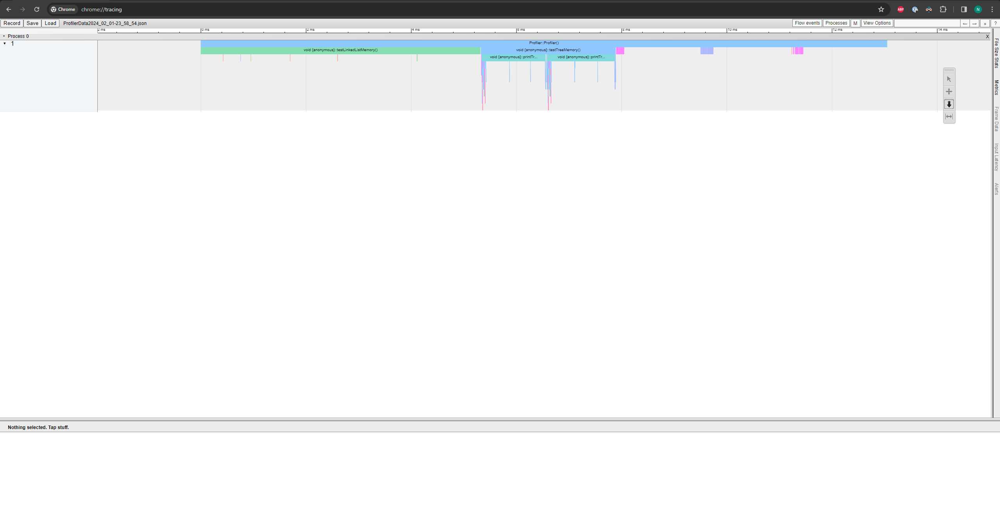
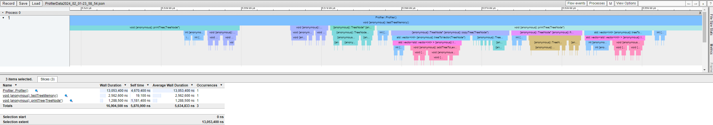
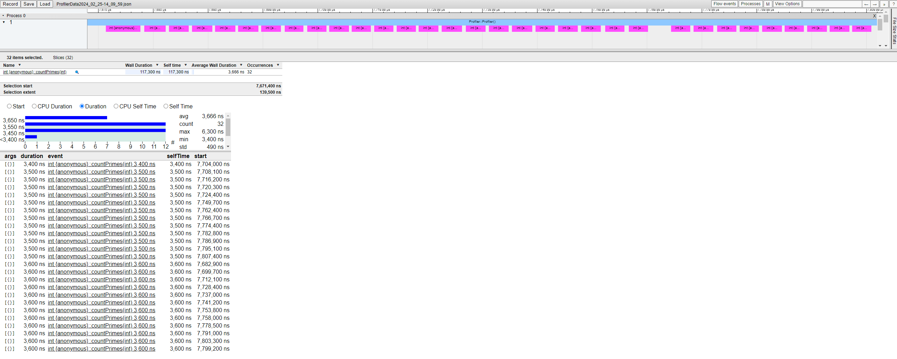
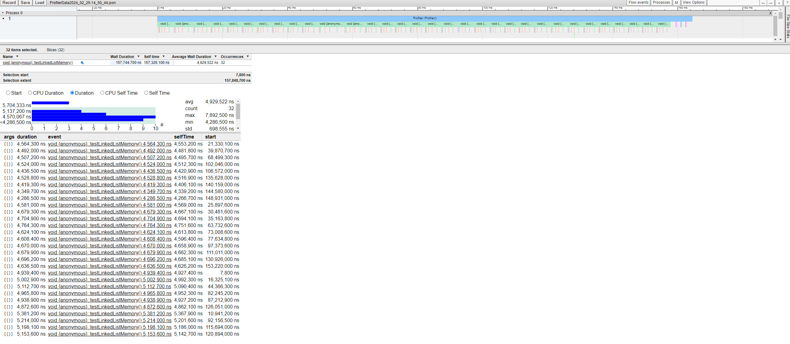
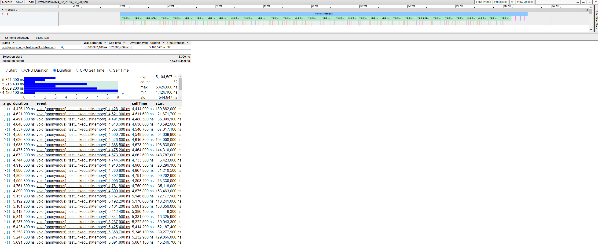
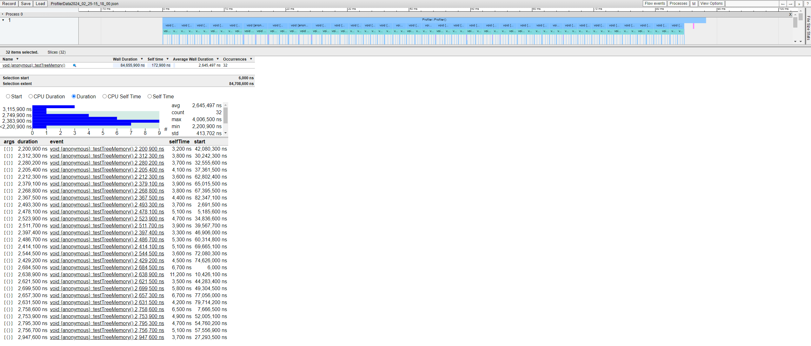
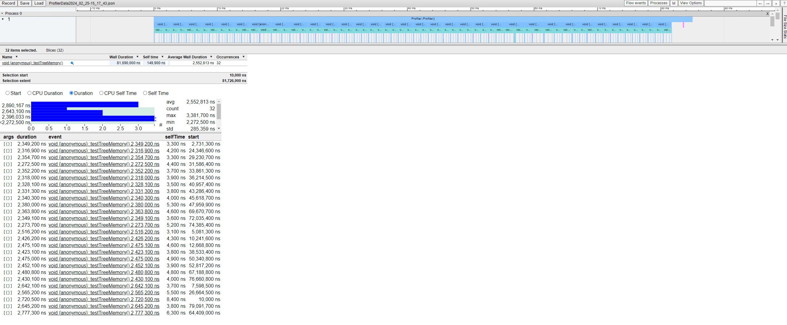
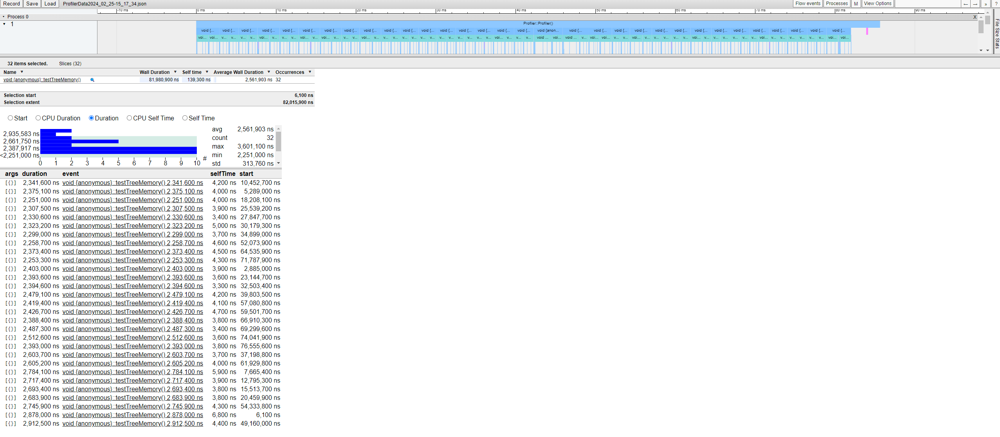

# **C++ Runtime Profiler**

This library creates a json file that contains the runtime date for all functions that have a "ProfilerMarker" within them. The resulting json file is intended to be viewed with the [chrome tracing tool][chrometracing] built into Google Chrome ([chrome://tracing](chrome://tracing)). This allows for the data to be viewed in a visual format that is easy to undersatnd and dig down into.


>  Runtime data from a simple test program using list and tree functions.


> Zoomed in data with a three functions selected

## **Setup**
### **Include header file**
```c++
#include "performaceProfiler/performance.h"
```
### **Create a Profiler Object**
Create the "Profiler" object at the highest level of the program that requires runtime data.
```c++
int main(){
    // Create Profiler to track run time data.
    Profiler testProfiler;
    testTreeMemory();
    ...
}
```
### **add ProfilerMarkers**
Simply create a "ProfilerMarker" at that start of the target function.

```c++
void printTree(TreeNode* root){
    ProfilerMarker p;
    ...
}

void testTreeMemory(){
    ProfilerMarker p;
    ...
}
```

## **How it works**
There are 3 Classes in this library used for profiling runtime data: Profiler, ProfilerMarker, and Timer. The timer is used by the ProfilerMarkers and the Profiler to tack how long each ProfilerMarker exists.

### **Timer**
The Timer class uses an instace of system_clock to tack when the Timer object was created as well as how long that Timer has existed. The system_clock is initialize during the construction of a Timer object. 

### **ProfilerMarker**
The ProfilerMarker object gets the name of the function in which the ProfilerMarker is created and uses the aformentioned Timer to track how long the ProfilerMarker exists. Apon deconstuction the markerData is stored in static array to be writen to the json file at a later time (this is done to minimize the overhead of the ProfilerData on the runtime).

### **MarkerData**
MarkerData is a simple struct that contains the duration, function name, thread id, and start time for a ProfilerMarker
```c++
struct markerData {
    const double duration;
    const std::string funcName;
    const std::thread::id id;
    std::chrono::time_point<std::chrono::system_clock> start;
};
```

### **Profiler**
The Profiler object uses the Timer to track how long it exists, much like the ProfilerMarker. When the Profiler is deconstucted the Timer associated with it is destroyed, causing the markerData for the Profiler to be saved, and all of the markerData is writen to a json file that is [formatted][format] to work with the chrome tracer. The json files are stored in a subDirectory "ProfilerData" with the naming convention of "ProfilerDataYear_month_day-hour_min_sec.json".

# Overhead time of the profiler
I have collected data from 3 different senarios to show the difference between using this library and putting a timer around a function call. 

## Single Function
The first execution takes longer than subsequent executions due to the time that it takes to load the function into memory, this is much more noticable when the time is created outside of the function. With the first execution excuded the resulting averages are nearly identical. With the profiler the average is 3581ns and without the results are: 3562ns, 3604ns. There does not appear to be any noticable overhead and time that it takes to load the function into memory is less noticable with the profiler.



> Average, 3928ns, Min, 3500ns, Max, 15300ns, Complete Data, 15300ns, 3800ns, 3600ns, 3600ns, 3600ns, 3500ns, 3600ns, 3500ns, 3500ns, 3600ns, 3600ns, 3500ns, 3500ns, 3600ns, 3500ns, 3500ns, 3500ns, 3600ns, 3500ns, 3500ns, 3500ns, 3600ns, 3600ns, 3600ns, 3500ns, 3600ns, 3600ns, 3600ns, 3600ns, 3500ns, 3600ns, 3500ns

> Average, 4071ns, Min, 3500ns, Max, 18600ns, Complete Data, 18600ns, 3900ns, 3600ns, 3700ns, 3700ns, 3700ns, 3700ns, 3600ns, 3500ns, 3600ns, 3600ns, 3600ns, 3600ns, 3600ns, 3600ns, 3900ns, 3600ns, 3500ns, 3500ns, 3500ns, 3500ns, 3600ns, 3500ns, 3500ns, 3600ns, 3600ns, 3600ns, 3600ns, 3500ns, 3500ns, 3600ns, 3600ns


## Function With Sub Functions
The overhead begins to be noticable once there are some sub functions that are also being timed by the profiler.




> Average,4977096ns, Min,4291500ns, Max,6732900ns, Complete Data, 4843100ns, 4984200ns, 4502200ns, 4524000ns, 4291500ns, 4531400ns, 4528300ns, 4531900ns, 4992700ns, 5015600ns, 6181400ns, 5368500ns, 4839000ns, 4502600ns, 4551400ns, 5125900ns, 4869100ns, 5861500ns, 5201100ns, 5077200ns, 4847300ns, 4919200ns, 5538500ns, 4788600ns, 5108100ns, 6732900ns, 5869500ns, 5264100ns, 4691200ns, 4337300ns, 4507500ns, 4340300ns

> Average,4848453ns, Min,4361600ns, Max,5564400ns, Complete Data, 5558400ns, 4777000ns, 4793500ns, 5001500ns, 4858300ns, 5451500ns, 5046100ns, 5325000ns, 4779400ns, 4715100ns, 4509700ns, 4721000ns, 4534000ns, 4460700ns, 4588800ns, 5031300ns, 4718500ns, 4775800ns, 4948500ns, 4439700ns, 4439400ns, 5535500ns, 5564400ns, 4797700ns, 4822000ns, 4425800ns, 4375500ns, 4483000ns, 4361600ns, 4608300ns, 5279000ns, 5424500ns

> Average,4919887ns, Min,4387100ns, Max,7009700ns, Complete Data, 5228200ns, 4674500ns, 4941500ns, 4786200ns, 4588100ns, 5728400ns, 5302900ns, 5096600ns, 4836900ns, 4842100ns, 4839000ns, 4616800ns, 4499500ns, 4436600ns, 4767100ns, 5306500ns, 4939000ns, 4774600ns, 4595100ns, 4439900ns, 4581000ns, 4490000ns, 5445700ns, 5278100ns, 5187300ns, 4753500ns, 4445400ns, 4448500ns, 4765300ns, 4387100ns, 5405300ns, 7009700ns

## Function With Recursive Functions
The recursive functions show that the increase in overhead is directly related to the number of sub functions.





> Average,2364525ns, Min,2034000ns, Max,3133200ns, Complete Data, 2522400ns, 2626700ns, 2119700ns, 2310100ns, 3133200ns, 3050400ns, 2648900ns, 2140700ns, 2616200ns, 2078300ns, 2189000ns, 2056000ns, 2145800ns, 2034000ns, 2452300ns, 2338900ns, 2207500ns, 2202700ns, 2084600ns, 2400900ns, 2123900ns, 2718100ns, 2234700ns, 2616600ns, 2436100ns, 2305400ns, 2733300ns, 2437400ns, 2135100ns, 2236100ns, 2256100ns, 2073700ns

> Average,2313421ns, Min,2025500ns, Max,2861900ns, Complete Data, 2406000ns, 2075800ns, 2184400ns, 2079800ns, 2049600ns, 2194300ns, 2025500ns, 2054200ns, 2044900ns, 2371400ns, 2092000ns, 2210100ns, 2407900ns, 2856200ns, 2701100ns, 2799700ns, 2297700ns, 2116500ns, 2189900ns, 2065800ns, 2132900ns, 2082200ns, 2291700ns, 2091300ns, 2247600ns, 2229500ns, 2588500ns, 2770900ns, 2468300ns, 2708000ns, 2333900ns, 2861900ns

> Average,2441475ns, Min,2011400ns, Max,3251800ns, Complete Data, 2526300ns, 2183800ns, 2647800ns, 2804200ns, 2720100ns, 2714500ns, 2652800ns, 2144600ns, 2965500ns, 3056100ns, 2590900ns, 2331900ns, 2208700ns, 2484200ns, 2104000ns, 2217300ns, 2096900ns, 2064500ns, 2081400ns, 2158600ns, 2343600ns, 2500100ns, 2544200ns, 2011400ns, 2568400ns, 2695100ns, 3251800ns, 2334300ns, 2179900ns, 2364400ns, 2360300ns, 2219600ns

# **TODO**
* make the profiler thread safe

[chrometracing]: https://github.com/google/chrometracing
[format]: https://docs.google.com/document/d/1CvAClvFfyA5R-PhYUmn5OOQtYMH4h6I0nSsKchNAySU/preview#heading=h.yr4qxyxotyw